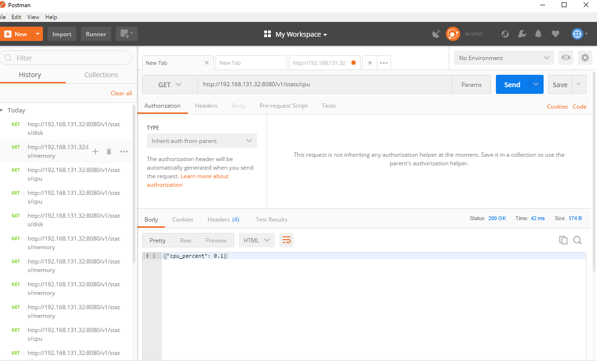
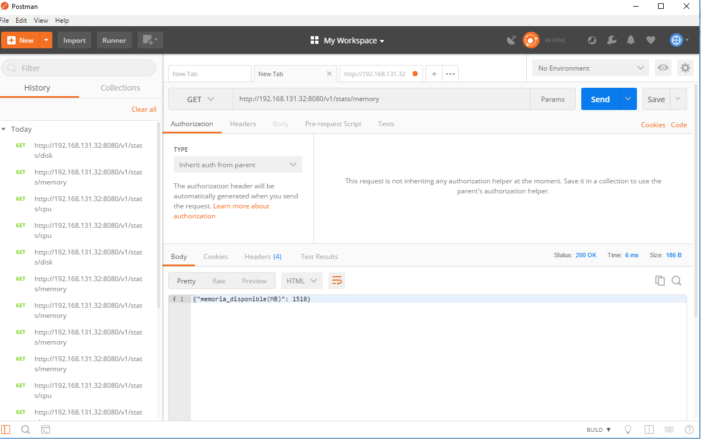
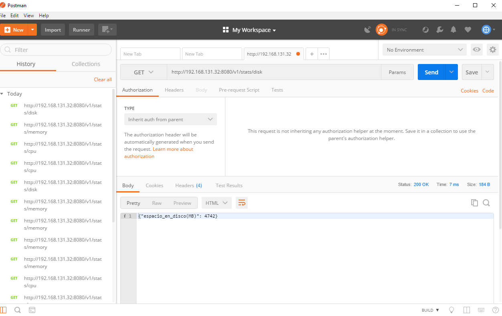
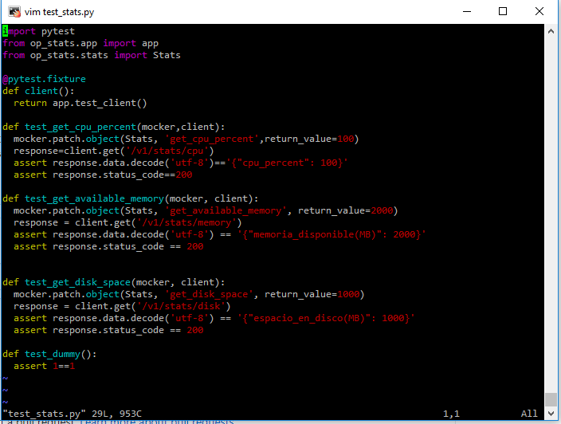
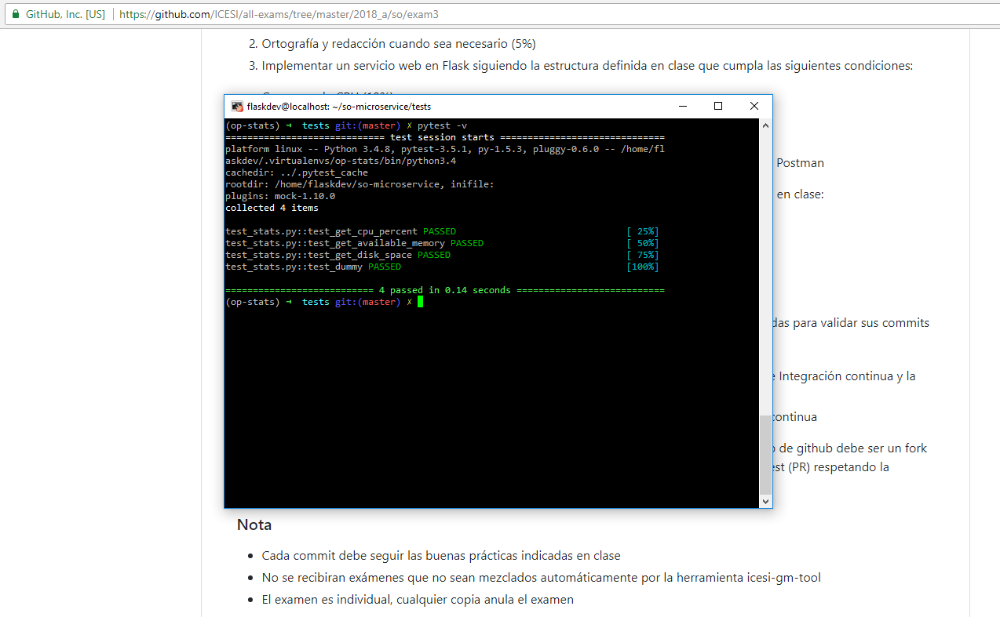
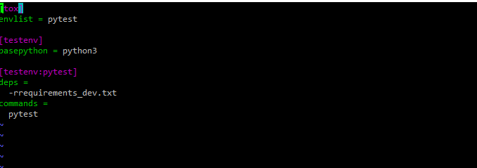
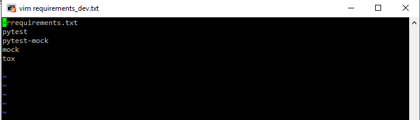
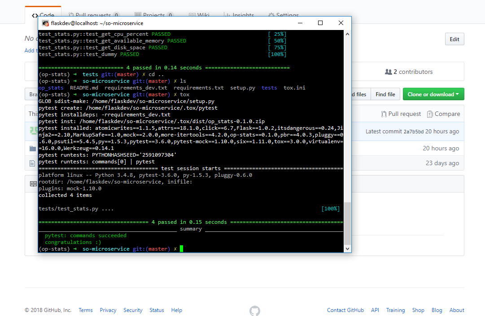
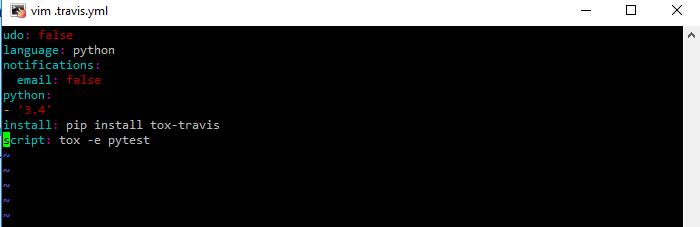
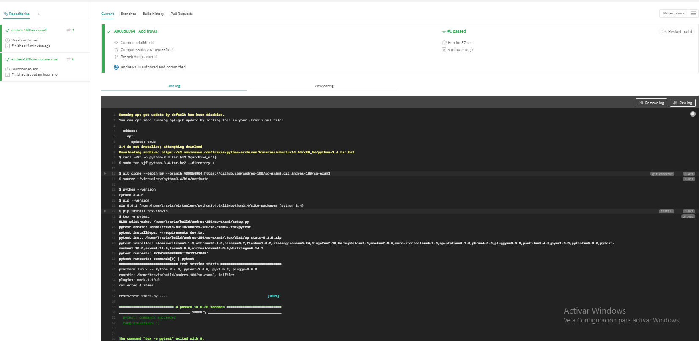

# so-exam3

**Universidad ICESI**  
**Curso:** Sistemas Operativos  
**Estudiante:** Andrés Felipe Pérez  
**Codigo:** A0056964   
**Link del repositorio:** https://github.com/andres-180/so-exam3

## Punto 3
Para esta parte se utiliza el sistema operativo CentOS con un ambiente virtual llamado op-stats.
Se realiza la instalacion de Flask y Psutil.

A continuación se muestra el archivo stats.py (contiene los métodos que se van a utilizar para obtener el uso de cpu, memoria utilizada y los datos de uso del disco duro):

A continuación se cre un archivo llamado app.py que será el encargado de exponer los servicios del web Flask mediante el uso del archivo status.py y asi obtener los datos de los retornos de los métodos que alli se encuentran:

Una vez se ejecuta el archivo app.py podemos observar que ya los servicios se encuentran ejecutándose:

Ahora se procede a usar la herramienta Postman y verificamos cada uno de los servicios expuestos:  
**Consumo de CPU**

**Memoria RAM disponible**

**Espacio disponible en disco**

## Punto 4

Una vez creados los servicios, se procede a realizar la etapa de pruebas, para ésto utilizamos pytest y como los datos de la cpu, memoria y disco pueden variar, utilizamos un mock para utilizar o generar los datos que necesitamos para ejecutar las pruebas. A continuación se muestra una captura de las pruebas:

Al ejecutar las pruebas usando pytest obtenemos:

## Punto 5

Una vez instalado tox (usado para la integración contínua), se procede a editar el archivo tox.ini para especificar las herramientas a usar. A continuación se muestra la configuración final del archivo:

Para el caso de las herramientas usadas es recomendable que esten en un archivo de especificación de requisitos de la aplicación que en este caso se llama requirements_dev.txt. A continuación se presenta el contenido de éste archivo:

Al ejecutar el comando tox obtenemos:

Por último, para ejecutar las pruebas usando travis, creamos un archivo .travis.yml y configuramos la ejecución de las pruebas:

A continuación se puede observar la integración con git y la ejecución exitosa de las pruebas:

