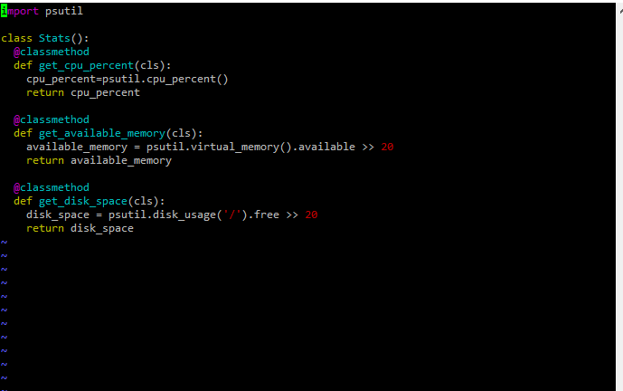
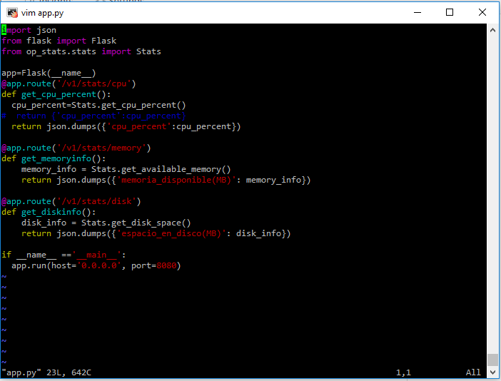
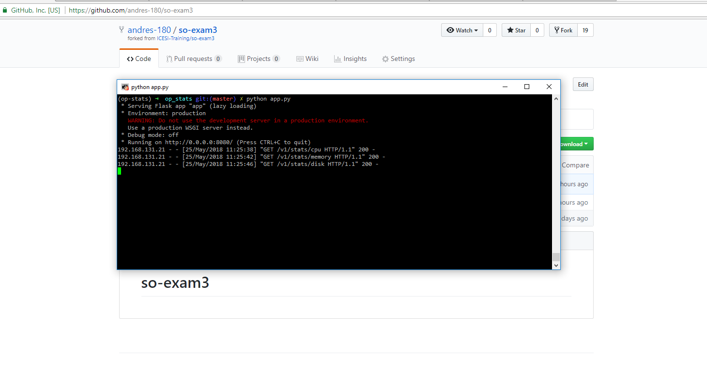

# so-exam3

**Universidad ICESI**  
**Curso:** Sistemas Operativos  
**Estudiante:** Andrés Felipe Pérez  
**Codigo:** A0056964

## Punto 3
Para esta parte se utiliza el sistema operativo CentOS con un ambiente virtual llamado op-stats.
Se realiza la instalacion de Flask y Psutil.

A continuación se muestra el archivo stats.py (contiene los métodos que se van a utilizar para obtener el uso de cpu, memoria utilizada y los datos de uso del disco duro):

A continuación se cre un archivo llamado app.py que será el encargado de exponer los servicios del web Flask mediante el uso del archivo status.py y asi obtener los datos de los retornos de los métodos que alli se encuentran:

Una vez se ejecuta el archivo app.py podemos observar que ya los servicios se encuentran ejecutándose:

